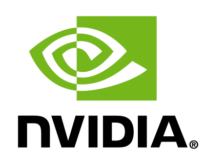
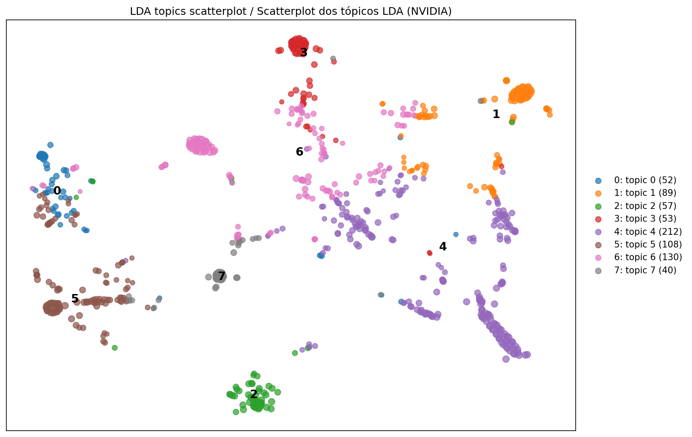
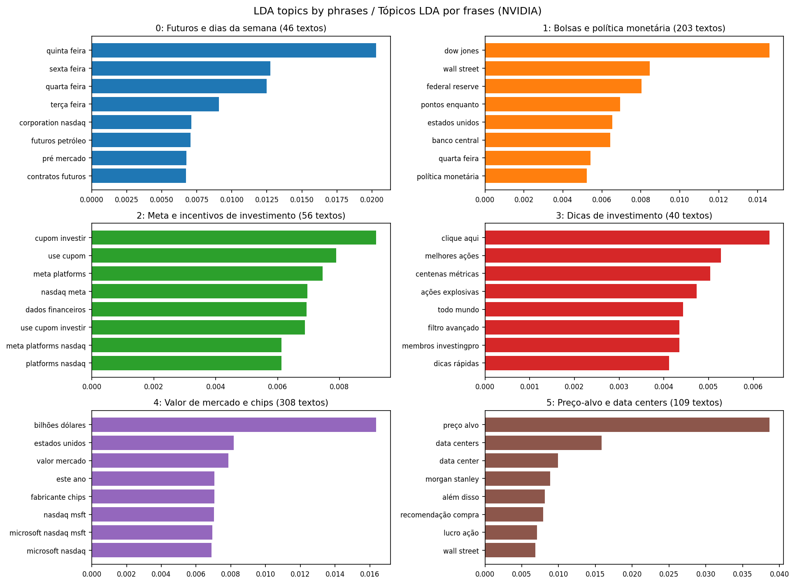

# LLM Agent NVIDIA</h1>

<p align="center">


</p>

<p align="center">
  
  
</p>

An LLM agent built with LangChain for data analysis and topic modeling (KMeans and LDA) on financial news, running an NVIDIA Nemotron model locally on Google Colab.

## Table of contents

- [Overview](#overview)
- [Dataset](#dataset)
- [Architecture](#architecture)
- [Agent tools](#agent-tools)
- [Preprocessing](#preprocessing)
- [Results](#results)
- [How to run](#how-to-run)
- [Issues found](#issues-found)
- [Limitations](#limitations)
- [Next steps](#next-steps)
- [Repository structure](#repository-structure)
- [Credits](#credits)

## Overview

This project builds an **LLM agent** that analyzes a financial news dataset. The agent decides on its own when to call each tool: inspect the DataFrame, run pandas code, search news by similarity, cluster texts with KMeans, and extract topics with LDA using two- and three-word phrases. At the end, it names the topics and generates the plots.

The model runs **locally on the Colab GPU**, served by vLLM through an OpenAI-compatible API, and is consumed by LangChain with tool calling.

Key points:

- Agent with structured tool calling on top of an open NVIDIA model.
- Topic modeling with **KMeans** (multilingual embeddings) and **LDA** (phrases of 2 to 3 words).
- Cleaning of templated text: news agency bylines, advertising and repeated daily reports.
- Plots generated by the agent itself: cluster scatterplot, LDA scatterplot and bar charts with the phrases of each topic.

## Dataset

Source: [magodobolo/nvidia-news](https://www.kaggle.com/datasets/magodobolo/nvidia-news) on Kaggle.

| File | Columns | Use in this project |
|---|---|---|
| `news_v1.csv` | `Company`, `Headline`, `Summary`, `Date` | Main analysis data |
| `nvidia_sentimental_analisis.csv` | `Date`, `Summary`, `sentiment_rf`, `sentiment_nn` | Available, not yet explored by the agent |

Profile of `news_v1.csv`, as reported by the agent:

| Item | Value |
|---|---|
| Rows | 1047 |
| Null values | 0 in every column |
| Companies | NVIDIA (911) and SPOTIFY (136) |
| Period | 2015-08-06 to 2024-06-14 |
| Language | Mostly Portuguese |

The `Date` column is stored as text and needs `pd.to_datetime` for time-based analysis. Of the 911 rows labeled NVIDIA, 28 do not mention the word "nvidia" in the headline or the summary. The `Company` label seems to indicate the source feed, not the subject of the article.

## Architecture

```text
Kaggle (nvidia-news)
        |
        v
  pandas DataFrame ----> text cleaning ----> embeddings / phrase counts
        |                                            |
        v                                            v
 LangChain agent  <----  vLLM server  <----  NVIDIA Nemotron-3-Nano-30B-A3B-FP8
        |                (OpenAI API, port 8000, tool calling)
        v
 Tools: pandas, semantic search, KMeans, LDA, plots
```

| Component | Detail |
|---|---|
| Environment | Google Colab, G4 GPU (NVIDIA RTX PRO 6000 Blackwell, about 97 GB of VRAM) |
| LLM | `nvidia/NVIDIA-Nemotron-3-Nano-30B-A3B-FP8`, served by vLLM |
| vLLM parsers | `qwen3_coder` (tool calling) and `nano_v3` (reasoning) |
| Orchestration | LangChain 1.x with `create_agent` |
| Semantic search | `sentence-transformers/all-MiniLM-L6-v2` with `InMemoryVectorStore` |
| Topic embeddings | `paraphrase-multilingual-MiniLM-L12-v2` |

## Agent tools

| Tool | What it does |
|---|---|
| `dataset_overview` | Shows shape, columns, dtypes, null counts and sample rows of the DataFrame |
| `run_pandas` | Runs pandas code on a copy of `df` and returns the last expression |
| `nvidia_news_search` | Semantic search over the news texts |
| `cluster_topics` | Clusters news with KMeans and returns size, keywords and representative headlines |
| `plot_clusters` | Draws the 2D scatterplot (t-SNE) of the clusters |
| `lda_topics` | Fits LDA with 2- to 3-word phrases and returns topics, coherence and headlines |
| `plot_lda_topics` | Bar chart with the top phrases of each topic |
| `plot_lda_scatter` | 2D scatterplot of the news colored by dominant topic |

## Preprocessing

Before topic modeling, the text goes through these steps:

1. Removal of the credit lines in parentheses, such as "(Reportagem de ...)", which polluted the keywords with journalist names.
2. Removal of **43 sentences** repeated across many articles, mainly InvestingPro advertising and fixed blocks of the market wrap reports.
3. Removal of links, numbers and exchange labels such as `(NASDAQ:MSFT)`.
4. Headline deduplication after stripping numbers, so repeated daily reports count only once.
5. Exclusion of **71 daily market reports** (opening and closing wraps) from the LDA input.
6. Stop words in Portuguese and English, including weekdays and promotional terms.

NVIDIA rows used by LDA: 911, then 762 after deduplication, then **741** after excluding the daily reports.

## Results

### Exploratory analysis by the agent

The agent called `dataset_overview` and `run_pandas` on its own and reported: 1047 records, 4 columns, no null values, 911 NVIDIA articles and 136 Spotify articles, from August 2015 to June 2024.

### LDA topics (phrases of 2 to 3 words, 8 topics)

Input: 741 articles, 3000 phrases. Mean UMass coherence: **-1.71**. Share of texts with a dominant topic above 0.5: **0.80**.

The key phrases are shown as extracted, in Portuguese. The topic readings are interpretations of the phrases and of the representative headlines.

| Topic | Texts | Reading | Highlighted phrases |
|---|---|---|---|
| 0 | 52 | Wall Street indexes, chips and interest rates | wall street, pontos enquanto, taxa juros |
| 1 | 89 | Analyst recommendations and price targets | lucro ação, itaú bba, goldman sachs |
| 2 | 57 | Market agenda and interest rates | contratos futuros, presidente fed, horário brasília |
| 3 | 53 | Stock rally, AI and China restrictions | restrições exportação, chips china, titãs tecnologia |
| 4 | 212 | Earnings, price targets and data centers | preço alvo, data centers, morgan stanley |
| 5 | 108 | NYSE and Nasdaq closes, Fed and monetary policy | dow jones, federal reserve, política monetária |
| 6 | 130 | NVIDIA market value | bilhões dólares, valor mercado, fabricante chips |
| 7 | 40 | Market closes and export restrictions (mixed topic) | subiu pontos, fecharam alta, primeiro trimestre |

Example of a representative headline for topic 6: "Nvidia ultrapassa Apple e se torna a segunda empresa mais valiosa do mundo" (Nvidia overtakes Apple to become the world's second most valuable company).

Comparison of the number of topics (run before the daily reports were excluded):

| Topics | UMass coherence | Texts with dominant topic > 0.5 |
|---|---|---|
| 4 | -1.84 | 0.95 |
| 6 | -1.56 | 0.90 |
| 8 | -1.49 | 0.84 |
| 10 | -1.70 | 0.82 |
| 12 | -1.68 | 0.76 |

### KMeans clusters (6 clusters)

| Cluster | Texts | Theme |
|---|---|---|
| 0 | 212 | Price targets and recommendations |
| 1 | 125 | Daily market moves (templated reports) |
| 2 | 166 | Funds and large technology companies |
| 3 | 57 | Megacaps and Wall Street |
| 4 | 157 | New processors, AI and chips for China |
| 5 | 194 | Interest rates, inflation and monetary policy |

The silhouette score was **0.102**. Between 3 and 12 clusters it varied only from 0.082 to 0.11, which indicates that the articles form a continuous cloud with no well-separated groups. This run used embeddings generated before the agency bylines were removed.

### Plots

| Cluster scatterplot (KMeans) | Topic scatterplot (LDA) |
|---|---|
|  |  |



### How to read the results

- UMass coherence favors phrases that repeat together, so templated text tends to inflate it. Use it to compare topics with each other, not as a quality grade. The advertising topic once had the best coherence before cleaning.
- In t-SNE, local neighborhoods matter. The distance between far-apart groups has no reliable meaning.
- Very dense blocks in the LDA scatterplot are usually near-identical texts that land on the same point.

## How to run

Prerequisites:

- A Google Colab account with access to a high-memory GPU (the tests used the G4).
- Colab secrets: `HF_TOKEN` and `kaggle_api`. The `nvidia_api` secret was configured but is not used in this flow.
- Acceptance of the NVIDIA model terms on Hugging Face, when requested.

Steps:

1. Open the notebook in Colab with the G4 GPU.
2. Install the dependencies and **restart the session**.
3. Run the cells for data, embeddings and text cleaning.
4. Start the vLLM server and wait for the `server ready` message (the first download is over 30 GB).
5. Create the tools and the agent, then ask your questions.

```bash
# install all dependencies in one resolver pass
pip install -U vllm langchain langchain-core langchain-openai langchain-huggingface langchain-text-splitters langgraph sentence-transformers kagglehub
```

Example question for the agent:

```python
# topic analysis with the scatterplot
question = "Run an LDA topic analysis of the NVIDIA news using phrases with 8 topics, name each topic and show the scatterplot."
```

## Issues found

| Issue | Cause | Fix |
|---|---|---|
| `ImportError: ModelAPIError` when importing `langchain_openai` | The old `langchain-core` was still loaded in memory after the upgrade | Restart the Colab session |
| `PyTorch and TorchAudio were compiled with different CUDA versions` | vLLM upgraded `torch`, and the published `torchaudio` does not follow that version | Uninstall `torchaudio`, which the project does not use |
| `Connection refused` on port 8000 | The vLLM server was not running | Read `vllm.log` and start the server again |
| `No supported CUDA architectures found for major versions [12]` | JIT compilation of FlashInfer FP8 kernels on the Blackwell GPU | Set `FLASHINFER_CUDA_ARCH_LIST` or try the BF16 weights of the model |
| Plots not shown by the agent | The agent did not call the plot tool, or inline display failed | Call the tools directly and display the saved PNGs |

## Limitations

- **Topic quality**: LDA on about 700 short texts is unstable. Change the `random_state` and check whether the main topics repeat.
- **Low silhouette**: KMeans clusters overlap. Choose the number of clusters by reading the headlines.
- **Residual templated text**: variations of advertising ("use investir") still show up in one topic, and topics 4 and 7 are broad or mixed.
- **Company label**: `Company == "NVIDIA"` indicates the feed, and part of the news covers the market in general.
- **Code execution**: the `run_pandas` tool uses `exec` on model-generated code. It runs in the Colab VM, which is fine for personal use, but it should not be exposed to third parties without a sandbox.
- **Agent summaries**: the agent can misreport results, for example by ranking topics by coherence. Always check the tool results printed in the notebook.

## Next steps

- [ ] Classify news sentiment with prompt engineering (zero-shot, few-shot and rubric) and compare with `sentiment_rf` and `sentiment_nn`.
- [ ] Evolution of each topic over the years, converting `Date` with `pd.to_datetime`.
- [ ] Flag the articles that name NVIDIA in the headline and compare topics with and without that filter.
- [ ] Test HDBSCAN or BERTopic, which allow articles with no assigned topic.
- [ ] Rerun KMeans with embeddings built from the cleaned text.

## Repository structure

Adjust the names to match the real files in the folder.

```text
LLM-Agent-Nvidia/
├── img/            # README cover image
├── output/         # plots and agent results
├── notebooks/      # Colab notebook
└── README.md
```

## Credits

- Dataset: [magodobolo/nvidia-news](https://www.kaggle.com/datasets/magodobolo/nvidia-news) on Kaggle.
- Model: [NVIDIA Nemotron-3-Nano-30B-A3B-FP8](https://huggingface.co/nvidia/NVIDIA-Nemotron-3-Nano-30B-A3B-FP8) on Hugging Face.
- Cover image: [abstract banner with modern low poly plexus design](https://www.magnific.com/br/vetores-gratis/banner-abstrato-com-design-moderno-de-plexo-poli-baixo_12965273.htm), via Magnific. Check the license and the required attribution before publishing.

Author: Rafael
